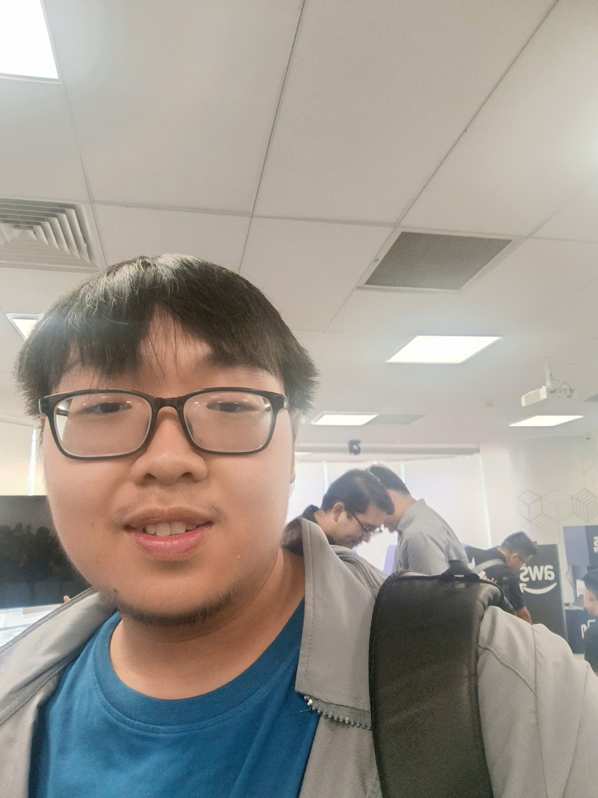

# Triển lãm Agentic AI Build Week (FCAJ x BBAW)

Chào mừng bạn đến với kho lưu trữ dự án dành cho **Agentic AI Build Week (FCAJ x BBAW)**. Sự kiện này đã triển lãm các hệ thống tác tử tự vận hành (autonomous agent systems) cấp độ sản xuất (production-grade), các luồng xử lý thị giác máy tính theo thời gian thực (real-time computer vision pipelines) và các giải pháp kiến trúc đám mây tự động được xây dựng trên Amazon Web Services (AWS).

---

## Các dự án tiêu biểu

### 1. Signal Scout
* **Đội thi**: Dream AI Team
* **Thành viên**: Lê Tấn Lực, Đỗ Hoàng Hiếu, Triệu Quốc Hào, Nguyễn Văn Duy Khiêm, Nguyễn Công Minh, Nguyễn Trần Minh Quân

#### Tổng quan
Signal Scout kết nối các chỉ số và tín hiệu doanh nghiệp phân tán thành một câu chuyện rõ ràng, có thể kiểm chứng. Dự án cho phép phát hiện sớm các thay đổi chiến lược và tín hiệu tái cấu trúc của doanh nghiệp, cung cấp hỗ trợ ra quyết định minh bạch cho các đội ngũ chiến lược doanh nghiệp, quản trị rủi ro và tình báo cạnh tranh.

#### Các tính năng chính
* **Xác thực chứng cứ**: Thu thập và xác thực dữ liệu doanh nghiệp từ các nguồn công khai.
* **Xây dựng kịch bản chỉ số**: Phân tích các chỉ số tài chính/vận hành để dự báo các kịch bản chiến lược.
* **Hỗ trợ ra quyết định có thể thực thi**: Giúp các đội ngũ doanh nghiệp quyết định nên *Duy trì, Thích ứng, hay Đẩy nhanh* các định hướng chiến lược.

#### Kiến trúc & Tập công nghệ (Tech Stack)
* **Lớp AI**: Amazon Bedrock, AgentCore Short-Term Memory, AgentCore Runtime
* **Dữ liệu & Lưu trữ**: Amazon DynamoDB, S3 Intelligent-Tiering, Secrets Manager
* **Hosting & Web**: AWS Amplify Hosting, AWS WAF, API Gateway (HTTP), Route53, Amazon Cognito
* **Giám sát & Công cụ**: AWS CloudWatch, CloudTrail, AWS Lambda, Langfuse, Apify, TinyFish

---

### 2. S.H.E.P.H.E.R.D.
* **Đội thi**: 3KA
* **Thành viên**: Huỳnh An Khương, Nguyễn Quốc Huy, Ngô Quang Khôi, Hoàng Lê Thành Đức, Đặng Nguyễn Phước Lộc, Đặng Trường Hưng

#### Tổng quan
**S.H.E.P.H.E.R.D.** (*Smart Human-flow Evaluation, Prediction, Hazard Detection, Response, and Dispatch - Đánh giá, Dự báo, Phát hiện hiểm họa, Phản ứng và Điều phối luồng người thông minh*) chuyển đổi dữ liệu camera thô tại địa điểm thành thông tin tình báo vận hành đám đông chủ động. Được xây dựng nhằm giải quyết việc giám sát thủ công chậm trễ và thụ động, hệ thống dự báo áp lực quá tải và nhu cầu điều phối theo thời gian thực.

#### Các tính năng chính
* **Giám sát tự động**: Liên tục theo dõi mật độ đám đông, đo lường điều kiện hàng chờ và cảnh báo sớm các nguy cơ ùn tắc.
* **Trợ lý vận hành (Operator Copilot)**: Cho phép người vận hành truy vấn các chỉ số thời gian thực bằng ngôn ngữ tự nhiên và nhận các khuyến nghị hành động tự động.

#### Kiến trúc & Tập công nghệ (Tech Stack)
* **Thị giác máy tính**: YOLO + ByteTrack
* **Suy luận & Tác tử AI**: Amazon SageMaker, Amazon Bedrock AgentCore, Strands Agent
* **Giao diện**: Dashboard giám sát bằng React

---

### 3. Solution Architect Professional AI Native App
* **Đội thi**: Plan V
* **Thành viên**: Phạm Tiến Thuận Phát, Huỳnh Hoàng Long, Lê Minh Nghĩa, Trần Đại Vĩ, Nguyễn An

#### Tổng quan
Một trợ lý nguyên bản AI (AI-native assistant) được thiết kế cho các Kiến trúc sư giải pháp (Solution Architect) nhằm loại bỏ việc phân tích thủ công Tài liệu Yêu cầu Kinh doanh (BRD/PRD). Hệ thống đọc các yêu cầu phi cấu trúc, phác thảo các lựa chọn kiến trúc đám mây lai (hybrid-cloud) tuân thủ tiêu chuẩn, tạo sơ đồ Draw.io với các biểu tượng AWS chính thức, tạo mã IaC Terraform và tính toán ước tính chi phí AWS theo khu vực.

#### Các tính năng chính
* **Trích xuất yêu cầu tự động**: Phân tích đầu vào bằng ngôn ngữ tự nhiên để làm nổi bật các khoảng trống yêu cầu và các giả định.
* **Tạo sơ đồ & Mã nguồn**: Tự động xuất ra các sơ đồ Draw.io có thể chỉnh sửa và mã Terraform.
* **Ước tính chi phí**: Tính toán chi phí AWS ước tính định hướng (cho khu vực `ap-southeast-1`).

#### Kiến trúc & Tập công nghệ (Tech Stack)
* **Tính toán cốt lõi**: AWS Elastic Container Service (ECS Fargate), cơ sở dữ liệu PostgreSQL, Amazon EFS
* **AI & Dịch vụ tích hợp**: Amazon Bedrock, Draw.io MCP, AWS Pricing MCP, Knowledge Base
* **Mạng & Bảo mật**: AWS CloudFront, Application Load Balancer (ALB), NAT Gateway, VPC (Subnet Công khai/Riêng tư), Amazon Cognito, AWS CloudWatch, Amazon ECR
* **IaC & Công cụ**: Terraform

---

## Bảng so sánh tổng quan

| Dự án | Lĩnh vực / Bối cảnh giải quyết | Mô hình AI & Framework cốt lõi | Hạ tầng AWS then chốt |
| :--- | :--- | :--- | :--- |
| **Signal Scout** | Phát hiện sớm thay đổi chiến lược doanh nghiệp | Amazon Bedrock, AgentCore, Langfuse | DynamoDB, Amplify, AWS Lambda, CloudWatch |
| **S.H.E.P.H.E.R.D.** | Quản lý đám đông thông minh & Cảnh báo nguy cơ | YOLO, ByteTrack, Bedrock AgentCore | Amazon SageMaker, Amazon Bedrock |
| **SA Pro AI Native App** | Phân tích BRD, Tự động hóa Kiến trúc & IaC | Bedrock, Draw.io MCP, AWS Pricing MCP | ECS Fargate, CloudFront, EFS, PostgreSQL |

---

## Bài học & Trải nghiệm rút ra từ sự kiện

1. **Dám xuất hiện là bước khởi đầu quan trọng**: Dũng cảm tham gia đã là một nửa chặng đường.
2. **Thu hẹp phạm vi & Hoàn thành**: Các mô hình thử nghiệm nhỏ nhưng hoạt động tốt sẽ đánh bại các ý tưởng lớn nhưng dang dở trong giới hạn thời gian hẹp.
3. **Luồng công việc Tác tử (Agentic Workflows)**: Việc áp dụng Model Context Protocol (MCP) và các tác tử Bedrock giúp tinh gọn đáng kể các tác vụ doanh nghiệp thực tế.

#### Một số hình ảnh sự kiện
