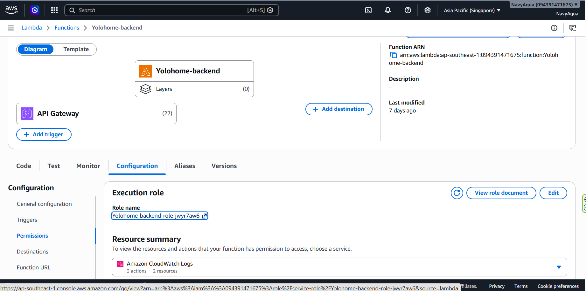
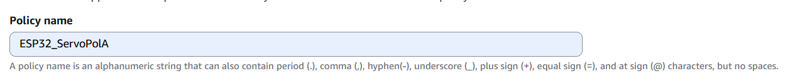

**AWS Lambda**

Go to AWS Lambda Console -> Configuration -> Permissions.



Click on the Role name under Execution role.

Under Permissions policies, click Add permissions -> Create inline policy.


Choose JSON and paste:

```
{
    "Version": "2012-10-17",
    "Statement": [
        {
            "Effect": "Allow",
            "Action": [
              "iot:Publish",
               "iot:Connect"
            ],
            "Resource": "*"
        }
    ]
}

```


Save the policy.


**AWS IOT Core**

Open the AWS IoT Core Console and navigate to Security -> Policies. Click Create Policy.

Enter a descriptive identifier



Switch to the JSON view or visual editor and specify the fine-grained statement actions:


```
{
  "Version": "2012-10-17",
  "Statement": [
    {
      "Effect": "Allow",
      "Action": "iot:Connect",
      "Resource": "arn:aws:iot:<REGION>:<ACCOUNT_ID>:client/${iot:Connection.Thing.ThingName}"
    },
    {
      "Effect": "Allow",
      "Action": [
        "iot:Publish",
        "iot:Receive"
      ],
      "Resource": "arn:aws:iot:<REGION>:<ACCOUNT_ID>:topic/*"
    },
    {
      "Effect": "Allow",
      "Action": "iot:Subscribe",
      "Resource": "arn:aws:iot:<REGION>:<ACCOUNT_ID>:topicfilter/*"
    }
  ]
}


```


