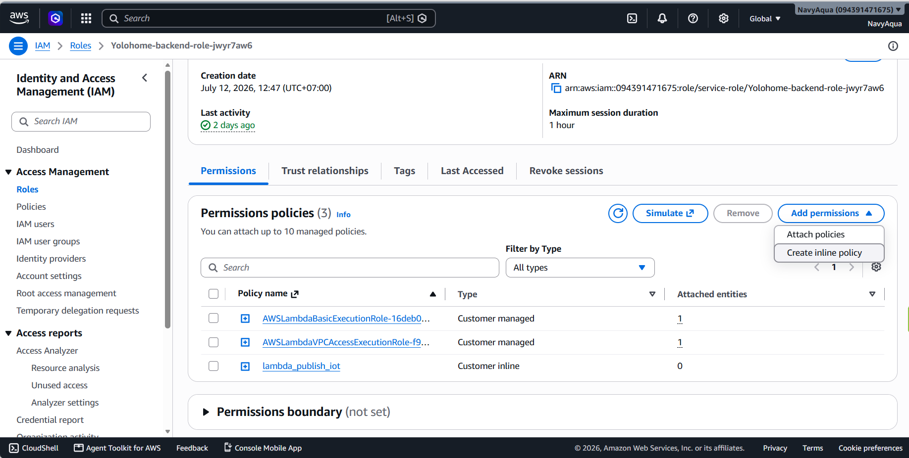
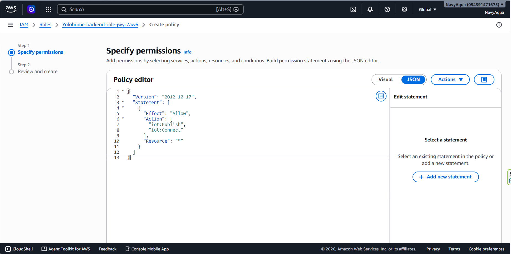
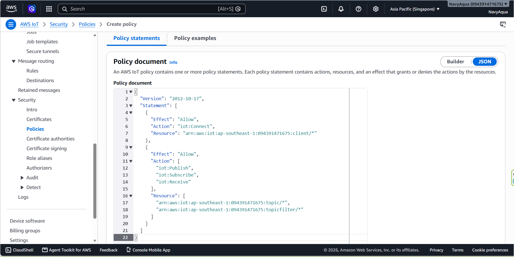

**AWS Lambda**

Truy cập AWS Lambda Console -> Configuration -> Permissions.


Nhấp vào Role name under Execution role.

Dưới Permissions policies, Nhấp Add permissions -> Create inline policy.




Chọn JSON and paste:

```
{
    "Version": "2012-10-17",
    "Statement": [
        {
            "Effect": "Allow",
            "Action": [
              "iot:Publish",
               "iot:Connect"
            ],
            "Resource": "*"
        }
    ]
}

```


Save the policy.


**AWS IOT Core**

Truy cập AWS IoT Core Console and navigate to Security -> Policies. Click Create Policy.

Nhập  descriptive identifier


Chuyển sang chế độ xem JSON hoặc trình chỉnh sửa trực quan và chỉ định các hành động câu lệnh chi tiết:

```
{
  "Version": "2012-10-17",
  "Statement": [
    {
      "Effect": "Allow",
      "Action": "iot:Connect",
      "Resource": "arn:aws:iot:<REGION>:<ACCOUNT_ID>:client/${iot:Connection.Thing.ThingName}"
    },
    {
      "Effect": "Allow",
      "Action": [
        "iot:Publish",
        "iot:Receive"
      ],
      "Resource": "arn:aws:iot:<REGION>:<ACCOUNT_ID>:topic/*"
    },
    {
      "Effect": "Allow",
      "Action": "iot:Subscribe",
      "Resource": "arn:aws:iot:<REGION>:<ACCOUNT_ID>:topicfilter/*"
    }
  ]
}


```




