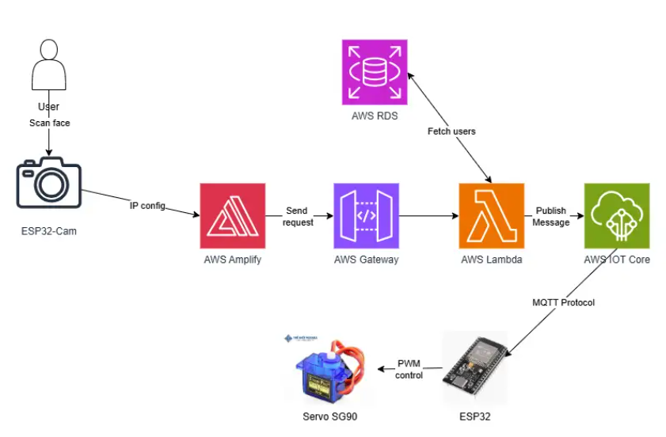

**Biometric Capture & Web Interface:**

The user’s facial image is captured by the ESP32-Cam module, which feeds the data (via IP configuration) directly into the web application hosted on AWS Amplify.

**API Routing & Business Logic:**

AWS Amplify dispatches an HTTP authentication request through AWS API Gateway, which routes the payload to an AWS Lambda serverless function.

**User Verification:**

AWS Lambda queries the AWS RDS database to fetch user credentials and verify whether the scanned face corresponds to an authorized user profile.

**IoT Messaging & Hardware Actuation:**

Upon successful verification, AWS Lambda publishes a trigger payload to AWS IoT Core.

AWS IoT Core transmits an unlock payload to the main ESP32 microcontroller over the MQTT protocol.

The ESP32 interprets the message and generates a Pulse Width Modulation (PWM) control signal to actuate the SG90 Servo motor, unlocking the physical door latch.

