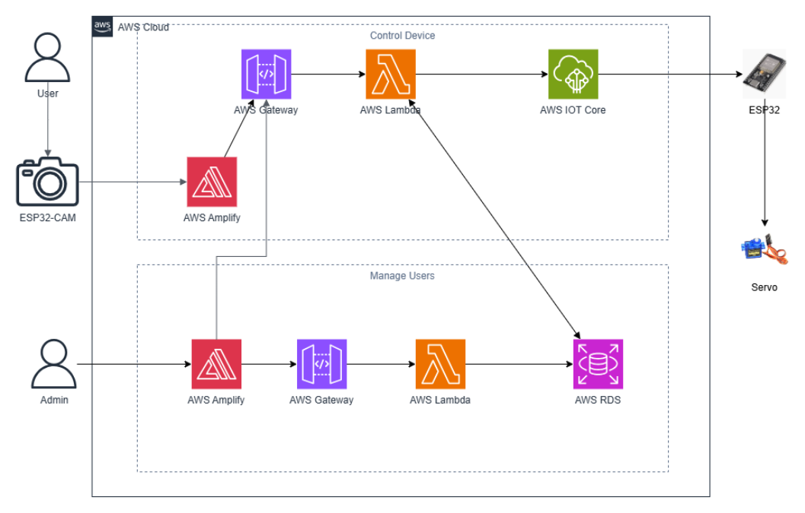

**Thu thập dữ liệu sinh trắc học & Giao diện web:**

Hình ảnh khuôn mặt của người dùng được thu thập bởi mô-đun ESP32-Cam, sau đó truyền dữ liệu (thông qua cấu hình IP) trực tiếp vào ứng dụng web được lưu trữ trên AWS Amplify.

**Định tuyến API & Logic nghiệp vụ:**

AWS Amplify gửi yêu cầu xác thực HTTP thông qua AWS API Gateway, sau đó định tuyến dữ liệu đến hàm không máy chủ AWS Lambda.

**Xác minh người dùng:**

AWS Lambda truy vấn cơ sở dữ liệu AWS RDS để lấy thông tin đăng nhập của người dùng và xác minh xem khuôn mặt được quét có khớp với hồ sơ người dùng được ủy quyền hay không.

**Nhắn tin IoT & Kích hoạt phần cứng:**

Sau khi xác minh thành công, AWS Lambda gửi một gói dữ liệu kích hoạt đến AWS IoT Core.

AWS IoT Core truyền gói dữ liệu mở khóa đến bộ vi điều khiển chính ESP32 thông qua giao thức MQTT.

ESP32 diễn giải thông điệp và tạo ra tín hiệu điều khiển Điều chế độ rộng xung (PWM) để kích hoạt động cơ servo SG90, mở khóa chốt cửa vật lý.

