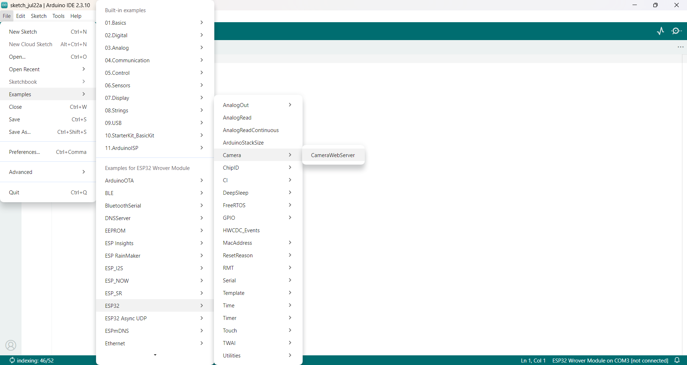
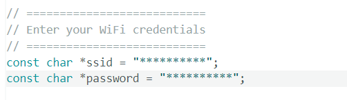
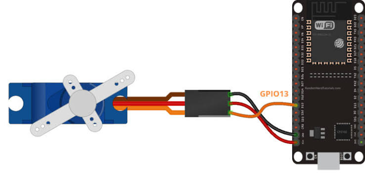

Phần mềm sử dụng: Arduino IDE.


**Cho ESP32**

main.ino

```
#include <WiFi.h>
#include <WiFiClientSecure.h>
#include <PubSubClient.h>
#include <ESP32Servo.h>
#include <ArduinoJson.h>

#include "secrets.h"
#include "aws_cert.h"

#define SERVO_PIN 13

WiFiClientSecure net;
PubSubClient client(net);

Servo myServo;

int currentAngle = 0;

void connectWiFi()
{
    Serial.print("Connecting to WiFi");

    WiFi.begin(WIFI_SSID, WIFI_PASSWORD);

    while (WiFi.status() != WL_CONNECTED)
    {
        delay(500);
        Serial.print(".");
    }

    Serial.println();
    Serial.println("WiFi connected");
    Serial.print("IP: ");
    Serial.println(WiFi.localIP());
}

void connectAWS()
{
    net.setCACert(AWS_ROOT_CA);
    net.setCertificate(AWS_CERT_CRT);
    net.setPrivateKey(AWS_PRIVATE_KEY);

    client.setServer(AWS_IOT_ENDPOINT, 8883);
    client.setCallback(messageHandler);

    Serial.println("Connecting to AWS IoT");

    while (!client.connected())
    {
        String clientId = "ESP32Servo-";
        clientId += String(random(0xffff), HEX);

        if (client.connect(clientId.c_str()))
        {
            Serial.println("AWS Connected");
        }
        else
        {
            Serial.print("Failed, rc=");
            Serial.print(client.state());
            Serial.println(" retrying...");
            delay(3000);
        }
    }

    client.subscribe(AWS_IOT_SUBSCRIBE_TOPIC);

    Serial.print("Subscribed: ");
    Serial.println(AWS_IOT_SUBSCRIBE_TOPIC);
}

void publishStatus(int angle)
{
    StaticJsonDocument<128> doc;

    doc["angle"] = angle;
    doc["status"] = "moved";

    char payload[128];

    serializeJson(doc, payload);

    client.publish(AWS_IOT_PUBLISH_TOPIC, payload);
}

void moveServo(int angle)
{
    angle = constrain(angle, 0, 180);

    myServo.write(angle);

    currentAngle = angle;

    Serial.print("Servo moved to: ");
    Serial.println(angle);

    publishStatus(angle);
}

void messageHandler(char* topic, byte* payload, unsigned int length)
{
    String msg;

    for(unsigned int i=0; i<length; i++)
    {
        msg += (char)payload[i];
    }

    Serial.println("Message received:");
    Serial.println(msg);

    StaticJsonDocument<128> doc;

    DeserializationError err = deserializeJson(doc, msg);

    if(err)
    {
        Serial.println("JSON Parse Error");
        return;
    }

    if(doc.containsKey("angle"))
    {
        int angle = doc["angle"];
        moveServo(angle);
    }
}

void setup()
{
    Serial.begin(115200);

    delay(2000);

    myServo.setPeriodHertz(50);
    myServo.attach(SERVO_PIN, 500, 2400);

    myServo.write(currentAngle);

    connectWiFi();

    connectAWS();
}

void loop()
{
    if(!client.connected())
    {
        connectAWS();
    }

    client.loop();
}


```

aws_cert.h (For configurating certificate, public key and private key)

```
#ifndef AWS_CERT_H
#define AWS_CERT_H

static const char AWS_ROOT_CA[] PROGMEM = R"EOF(

)EOF";

static const char AWS_CERT_CRT[] PROGMEM = R"KEY(

)KEY";

static const char AWS_PRIVATE_KEY[] PROGMEM = R"KEY(

)KEY";

#endif

```

secret.h (For configurating wifi and AWS IOT Core topic)

```

#ifndef SECRETS_H
#define SECRETS_H

#define WIFI_SSID       "***"
#define WIFI_PASSWORD   "***"

#define AWS_IOT_ENDPOINT \
"***"
#define AWS_IOT_SUBSCRIBE_TOPIC "***"
#define AWS_IOT_PUBLISH_TOPIC   "***"

#endif

```


**Cho ESP32-Cam**

Truy cập File > Examples > ESP32 > Camera và chọn CameraWebServer.


Cấu hình *ssid and *password wifi



**Cho servo SG90**

| SG90 Dây | Màu dây | ESP32 chân|
| :--- | :--- | :---: |
|  GND |  Nâu hoặc đen |  GND |
|  VCC | Đỏ |  5V or Vin | 
|  Signal | Cam hoặc Vàng | GPIO 13 | 



