**For AWS IOT Core**

In the console navigation pane, select All devices -> Things. Click **Create things**

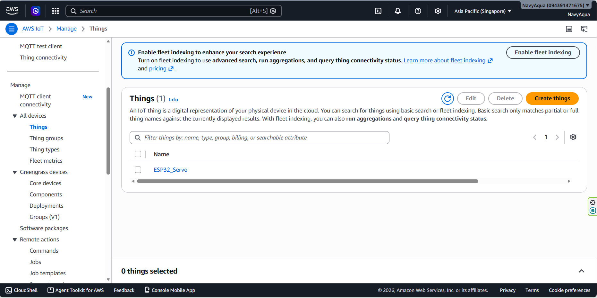

Select **Create single thing**.

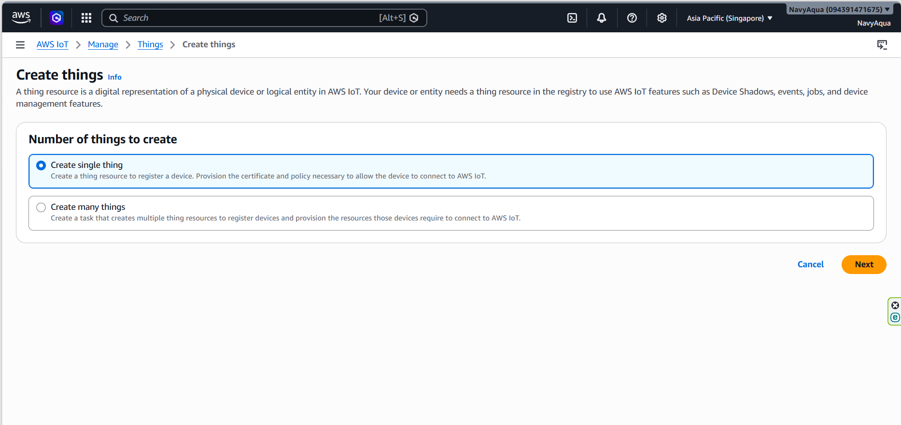


Enter **Thing name**.


Choose **Auto-generate a new certificate (recommended).**


Attach Policies to Certificate. Click **Create Thing**.

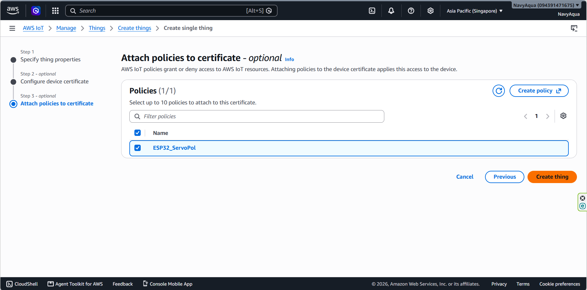


Click **Download all** to get Device Certificate, Private Key File, Private Key File, Amazon Root CA 1.

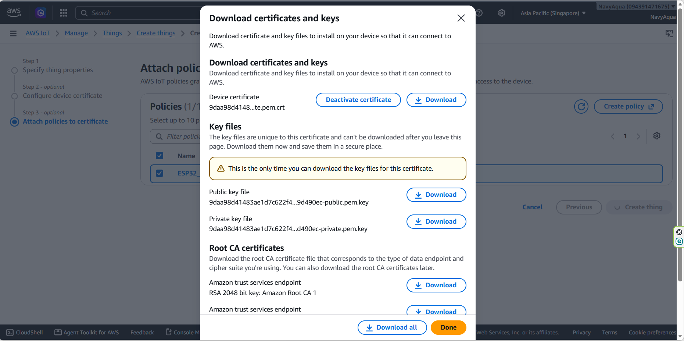


**For AWS Amplify**

Open the AWS Management Console and navigate to AWS Amplify. Click **Create new app** (or Host web app).

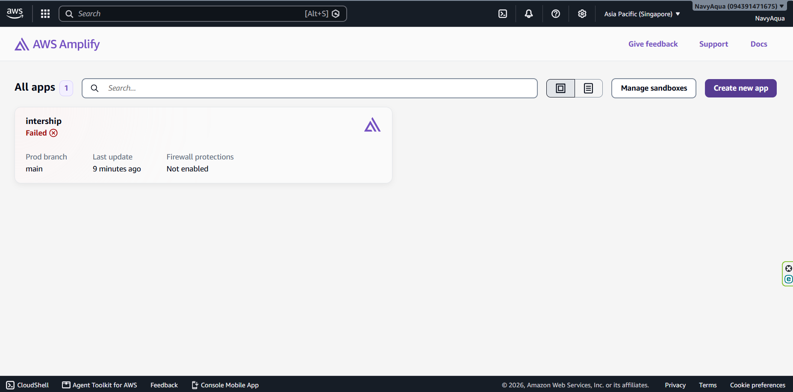


Select your git source code provider:


Authorize AWS Amplify to access your account and select the project Repository and default target Branch.

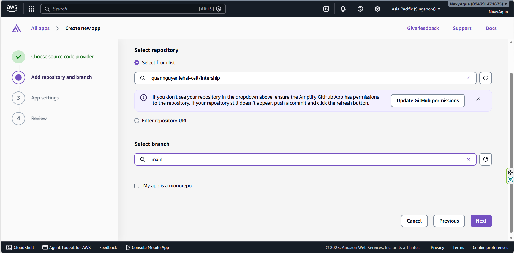

Review the build specification to ensure output directories match your build artifacts (e.g., dist, build, or ./ for raw HTML).


Change baseDirectory (if need).


Click **Next**, then click **Save and deploy**

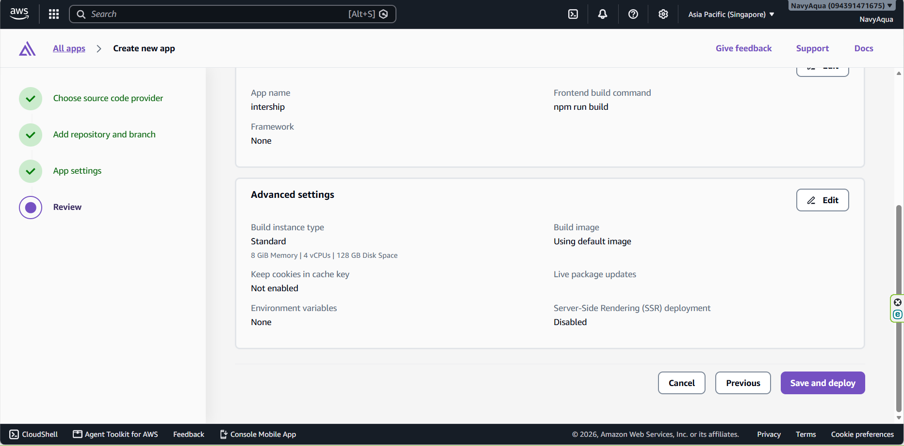


**For AWS Lambda**
Make a index.mjs file. This file will handle the logic for backend.

```
/**
 * YOLO Home — Express + MySQL Backend  (v2)
 * Chạy: node server/index.js
 */

import express from 'express'
import mysql   from 'mysql2/promise'
import cors    from 'cors'
import dotenv  from 'dotenv'
import { IoTDataPlaneClient, PublishCommand } from '@aws-sdk/client-iot-data-plane'
import serverlessExpress from '@codegenie/serverless-express' 
dotenv.config()

const app  = express()
const PORT = process.env.PORT || 3306

// AWS IoT Core config
const AWS_IOT_ENDPOINT = process.env.AWS_IOT_ENDPOINT
const AWS_REGION      = process.env.AWS_REGION || 'ap-southeast-1'
const SERVO_TOPIC     = process.env.AWS_IOT_SERVO_TOPIC || 'servo/control'
const AUTH_TOPIC      = process.env.AWS_IOT_AUTH_TOPIC || 'auth/trigger'

const awsIot = AWS_IOT_ENDPOINT
  ? new IoTDataPlaneClient({
      region: AWS_REGION,
      endpoint: `https://${AWS_IOT_ENDPOINT}`,
    })
  : null

app.use(cors())
app.use(express.json())

app.use((req, res, next) => {
  req.url = req.url.replace('/Yolohome-backend', '');
  next();
});


// ── DB POOL ────────────────────────────────────────────────────────
let pool = null

async function getPool() {
  if (pool) return pool;

  if (!process.env.DB_HOST || !process.env.DB_USER || !process.env.DB_NAME) {
    console.error("Missing DB_HOST, DB_USER, or DB_NAME in .env. Please configure your database connection.");
    process.exit(1); 
  }

  pool = mysql.createPool({
    host:               process.env.DB_HOST,
    port:               parseInt(process.env.DB_PORT) || 3306,
    user:               process.env.DB_USER,
    password:           process.env.DB_PASS, 
    database:           process.env.DB_NAME,
    waitForConnections: true,
    connectionLimit:    10,
    connectTimeout:     10000,
  })
  return pool
}

async function query(sql, params = []) {
  const db = await getPool()
  const [rows] = await db.query(sql, params)
  return rows
}

...

```

In Visual Studio Code, open the project, then open terminal and run:

```
npm install 
npm install @codegenie/serverless-express
```

It will has four object.


Zip the project. 

Open the AWS Lambda Console and click **Create function**.


Choose **Author from scratch**, enter **Function name**, set **Runtime** to Node.js 24.x. Then click **Create function**.


Click **Update** -> **Update from a .zip file**.

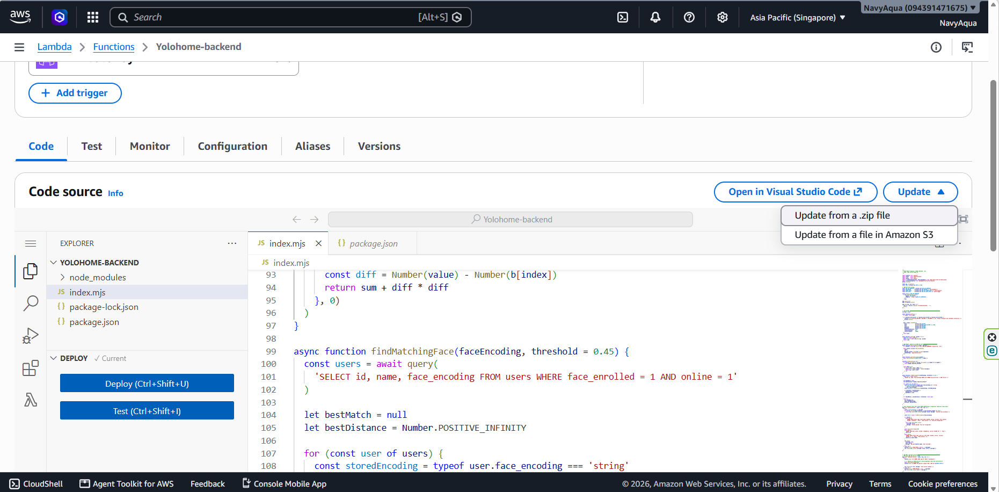

Choose the zipped project in last step and Click **Update**.

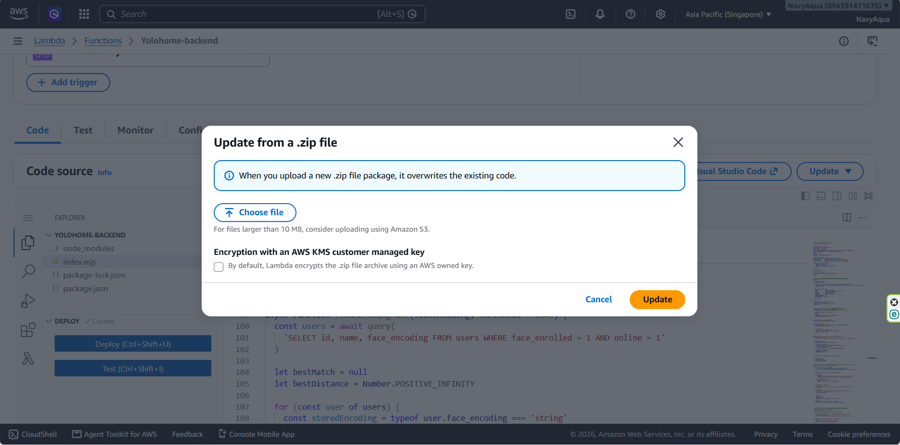


**For AWS Gateway**

On the AWS Lambda console, Click **Configuration**. Then choose **Trigger**. Click **Add trigger**.


Select **API Gateway**.


Create a new API, choose **REST API** and security **Open** then click **Add**.


Click on **Yolohome_backend-A-API**.


Click on **Resources**.

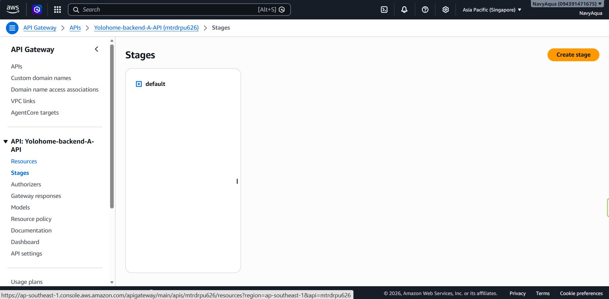

Click **Create resource**.

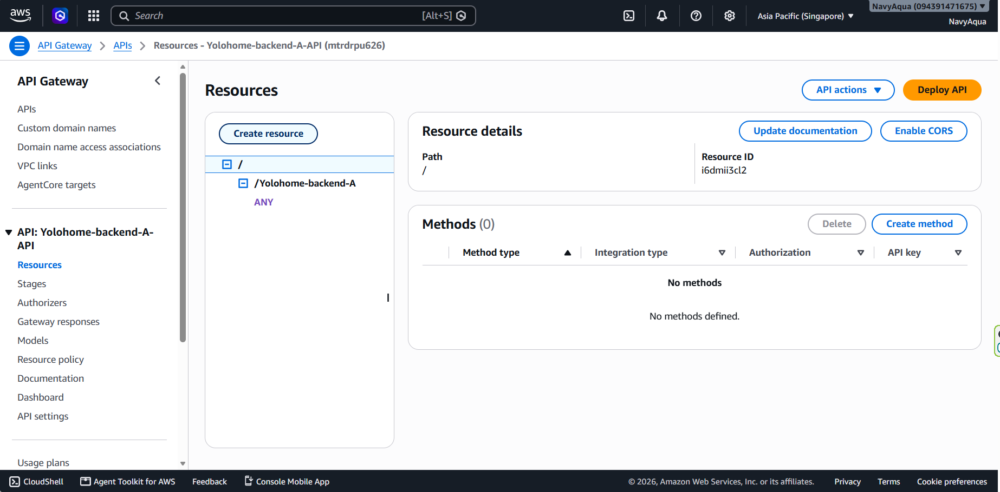


Choose **Proxy resource**, Select **Resource path**, Enter **Resource name** and Check **CORS (Cross Orgin Resource Sharing)**. Then click **Create resource**.

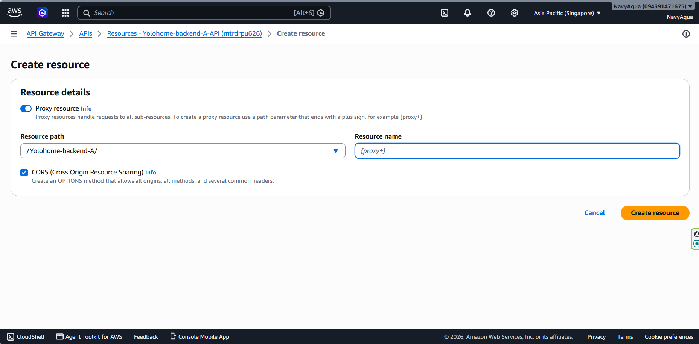


Click **Create method**.


Choose **Method type** and **Lamda Proxy** as **Integration type**.

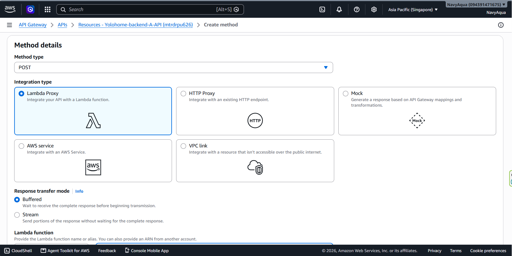

Choose **Lambda function** created before. 


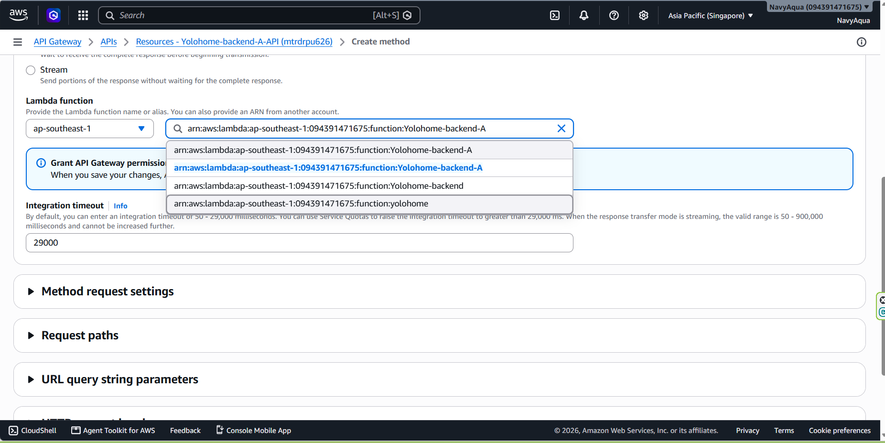

Click **Create method**.

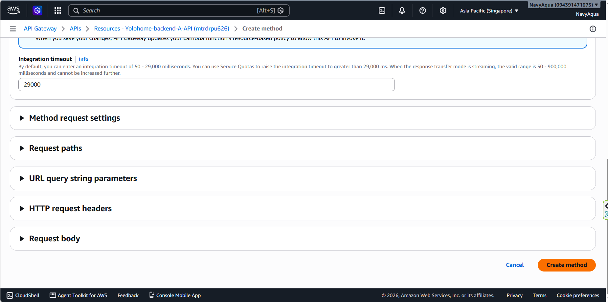

Do the same for the others path, then click **Deploy API**.


Choose **default**, then click **Deploy**.


Now the endpoint (act as an REST API) can be used to connect between frontend (AWS Amplify) and backend (AWS Lambda)


**For AWS RDS**

Open Aurora and RDS console and choose **CREATE** in **Create with full configuration**


Choose **Engine type** (in this case is MySQL). Then choose **Easy create**.


Scroll down at the end and click **Create database**.


Click on created database.

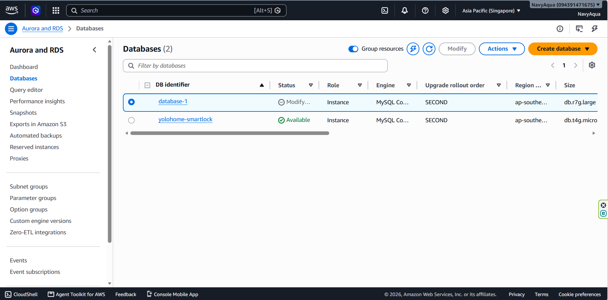

Find **Connectivity & security**.

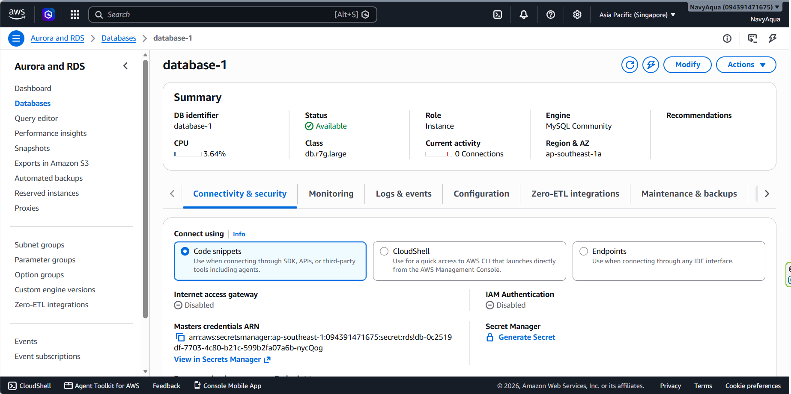
Click **CIDR/IP-Inbound**.


Click **Security group ID** link.


Choose **Edit inbound rules**.


Select **My IP**. Then **Save rules**.

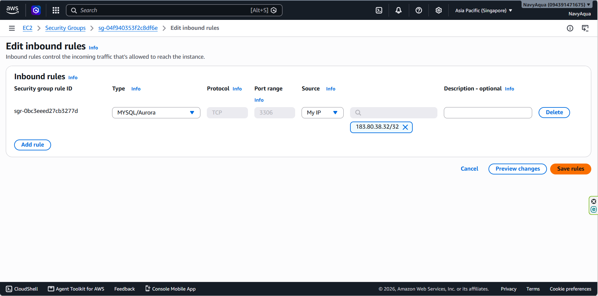
Return to created Lamdba function and find **Configuration** -> **Environment variables** to add environment variables for AWS IOT Core and AWS RDS.

