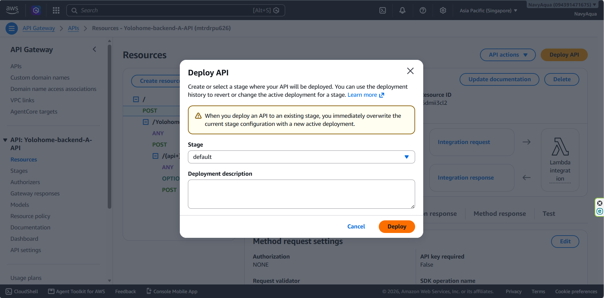

**Cho AWS IOT Core**

 Trong bảng điêyf khiển, chọn All devices -> Things. Nhấp **Create things**


Chọn **Create single thing**.


Nhập **Thing name**.


Chọn **Auto-generate a new certificate (recommended).**


Đính kèm Policies to Certificate. Click **Create Thing**.


Chọn **Download all** để lấy Device Certificate, Private Key File, Private Key File, Amazon Root CA 1.


**For AWS Amplify**

Mở bảng điều khiển AWS Management và điều hướng tới AWS Amplify. Bấm **Create new app** (hoặc Host web app).


Chọn git source code provider:


Ủy quyền AWS Amplify để truy cập vào tài khoản và chọn Repository và default target Branch.


Xem lại thông số kỹ thuật bản dựng để đảm bảo các thư mục đầu ra khớp với các tạo phẩm bản dựng của bạn (ví dụ: dist, build hoặc ./ cho HTML thô).


Chỉnh sửa baseDirectory (if need).


Bấm **Next**, sau đó **Save and deploy**


**For AWS Lambda**
Tạo một tệp index.mjs. Tệp này sẽ xử lý logic cho phần backend.

```
/**
 * YOLO Home — Express + MySQL Backend  (v2)
 * Chạy: node server/index.js
 */

import express from 'express'
import mysql   from 'mysql2/promise'
import cors    from 'cors'
import dotenv  from 'dotenv'
import { IoTDataPlaneClient, PublishCommand } from '@aws-sdk/client-iot-data-plane'
import serverlessExpress from '@codegenie/serverless-express' 
dotenv.config()

const app  = express()
const PORT = process.env.PORT || 3306

// AWS IoT Core config
const AWS_IOT_ENDPOINT = process.env.AWS_IOT_ENDPOINT
const AWS_REGION      = process.env.AWS_REGION || 'ap-southeast-1'
const SERVO_TOPIC     = process.env.AWS_IOT_SERVO_TOPIC || 'servo/control'
const AUTH_TOPIC      = process.env.AWS_IOT_AUTH_TOPIC || 'auth/trigger'

const awsIot = AWS_IOT_ENDPOINT
  ? new IoTDataPlaneClient({
      region: AWS_REGION,
      endpoint: `https://${AWS_IOT_ENDPOINT}`,
    })
  : null

app.use(cors())
app.use(express.json())

app.use((req, res, next) => {
  req.url = req.url.replace('/Yolohome-backend', '');
  next();
});


// ── DB POOL ────────────────────────────────────────────────────────
let pool = null

async function getPool() {
  if (pool) return pool;

  if (!process.env.DB_HOST || !process.env.DB_USER || !process.env.DB_NAME) {
    console.error("Missing DB_HOST, DB_USER, or DB_NAME in .env. Please configure your database connection.");
    process.exit(1); 
  }

  pool = mysql.createPool({
    host:               process.env.DB_HOST,
    port:               parseInt(process.env.DB_PORT) || 3306,
    user:               process.env.DB_USER,
    password:           process.env.DB_PASS, 
    database:           process.env.DB_NAME,
    waitForConnections: true,
    connectionLimit:    10,
    connectTimeout:     10000,
  })
  return pool
}

async function query(sql, params = []) {
  const db = await getPool()
  const [rows] = await db.query(sql, params)
  return rows
}

...

```

Trong Visual Studio Code, mở dự án, sau đó mở terminal và chạy:
```
npm install 
npm install @codegenie/serverless-express
```

Sẽ có bốn đối tượng.


Nén dự án lại.

Mở Bảng điều khiển AWS Lambda và nhấp vào **Create function**.


Chọn **Author from scratch**, Đặt **Function name**, để  **Runtime** thành Node.js 24.x. Sau đó nhấn **Create function**.


Nhấn **Update** -> **Update from a .zip file**.


Chọn dự án đã nén ở bước cuối cùng và nhấp vào **Update**.


**For AWS Gateway**

Trên bảng điều khiển AWS Lambda, Bấm **Configuration**. Chọn **Trigger**. Nhấn **Add trigger**.


Select **API Gateway**.


Tạo API mới, chọn **REST API** và bảo mật **OPEN**, sau đó nhấp vào **Add**.


Bấm vào **Yolohome_backend-A-API**.


Bấm vào **Resources**.


Nhấn **Create resource**.


Chọn **Proxy resource**, Chọn **Resource path**, Nhập **Resource name** và check **CORS (Cross Orgin Resource Sharing)**. Sau đó nhấn **Create resource**.


Chọn **Create method**.


Chọn **Method type** và **Lamda Proxy** là **Integration type**.


Chọn **Lambda function** tạo trước đó. 


Chọn **Create method**.


Thực hiện như trên cho các đường dẫn khác, sau đó nhấn **Deploy API**.


Chọn **default**, bấm **Deploy**.



Giờ đây, điểm cuối (hoạt động như một API REST) ​​có thể được sử dụng để kết nối giữa giao diện người dùng (AWS Amplify) và máy chủ (AWS Lambda).


**Cho AWS RDS**

Mở bảng điều khiển Aurora và RDS, sau đó chọn **CREATE** trong **Create with full configuration**


Chọn **Engine type** (in this case is MySQL). Chọn **Easy create**.


Cuộn xuống cuối trang và nhấp vào **Create database**.


Nhấp vào cơ sở dữ liệu đã tạo.


Tìm **Connectivity & security**.


Bấm **CIDR/IP-Inbound**.


Bấm **Security group ID** link.


Bấm **Edit inbound rules**.


Chọn **My IP**. Sau đó **Save rules**.


Quay lại hàm Lambda đã tạo và tìm **Configuration** -> **Environment variables** để thêm các biến môi trường cho AWS IOT Core vá AWS RDS.

