Uncomment  ``` #define CAM_MODEL_AI_THINKER ```, press the upload button to upload the code.

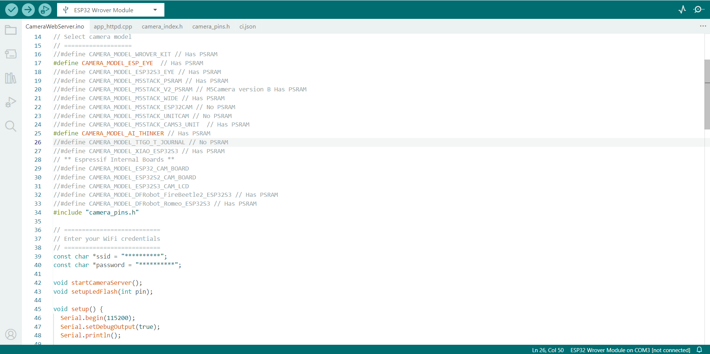

After upload the code, in **Serial Monitor**, copy ip link.
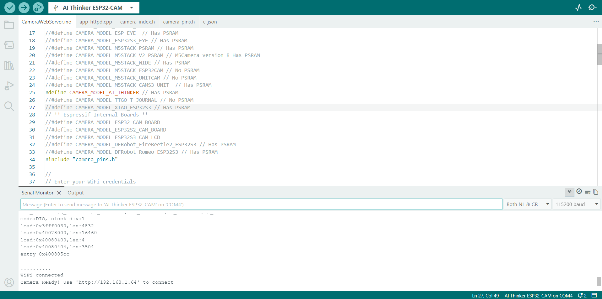

Upload code to esp32.
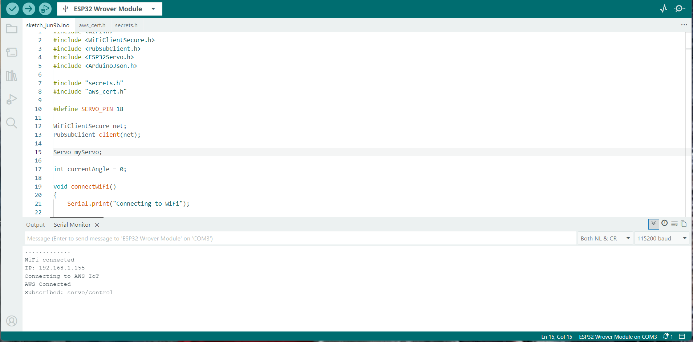

Open browser and paste copied link to make sure esp32-cam is working.
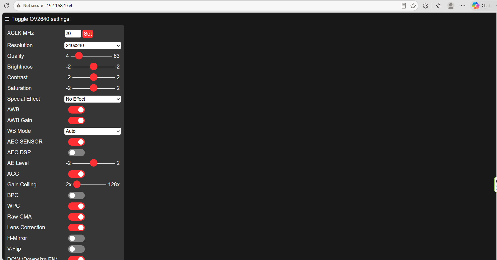

Log in as administrator.
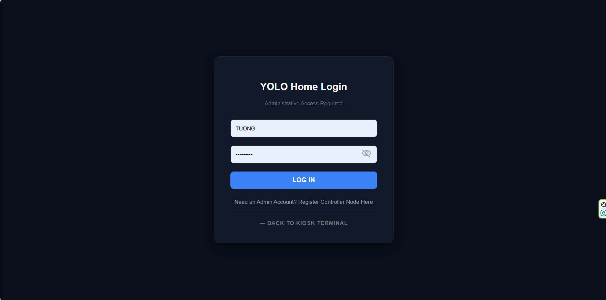

Enter ESP32-Cam copied link. Then press **go to door terminal**.
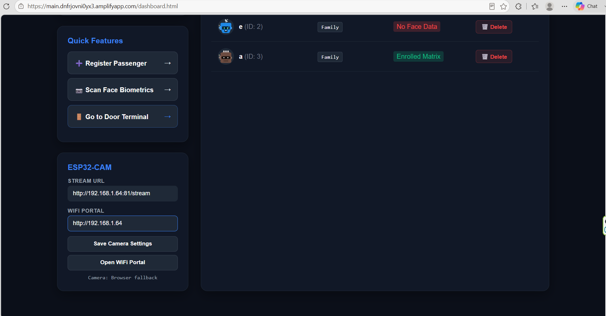

Test face-recognition. If the user in the database, the system inform **Welcome "user_name". Door unlocked**
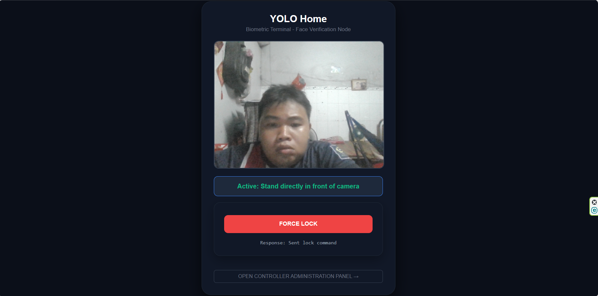

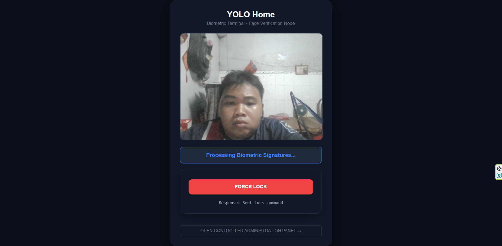

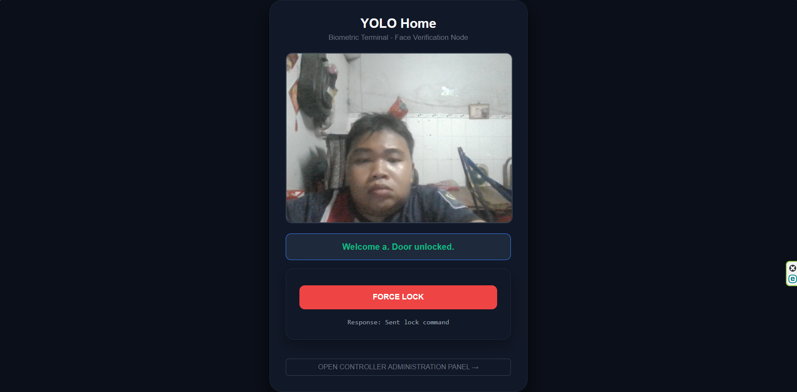

If not, the system inform **Access denied: face not recognized**

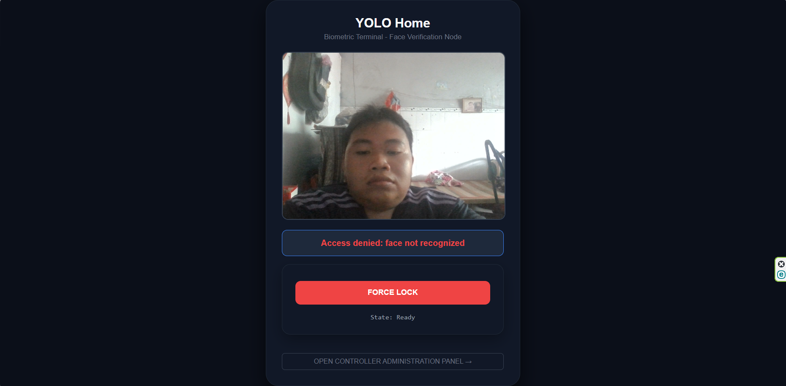
Go back to admin dashboard and press **FORCE UNLOCK**. It sent message **Response: Send unlock command**
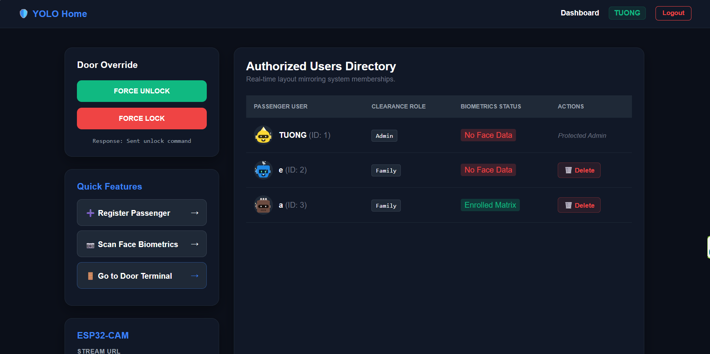

Press **FORCE UNLOCK**. It sent message **Response: Sent lock command**
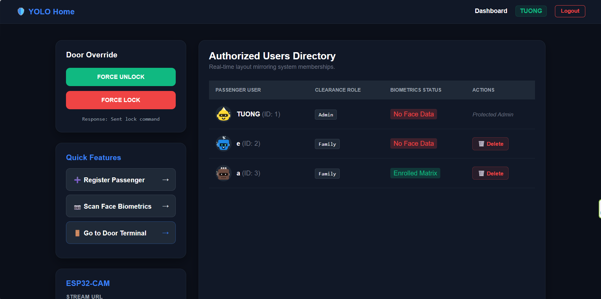

Press **Resgister Passenger** to register user.
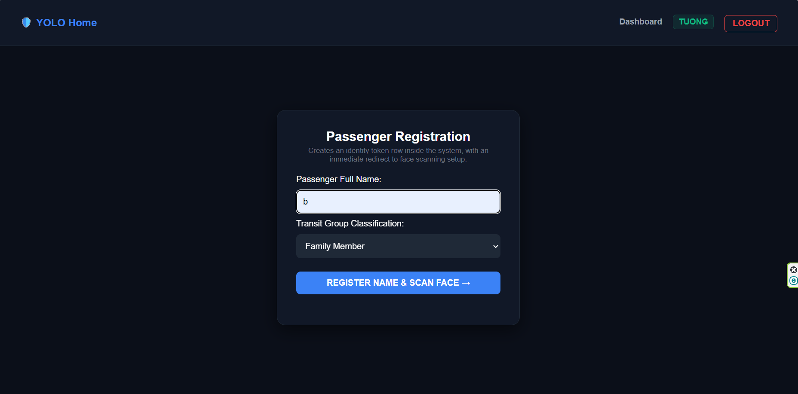

Scan face for registration.
Enter name and transitGroup Classification.
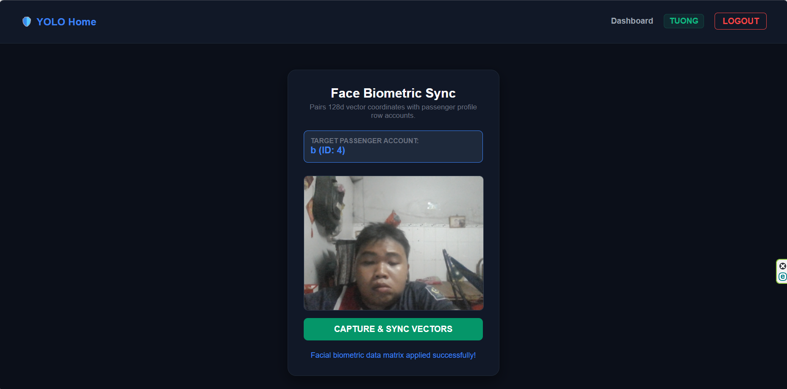

Press **Scan Face Biometrics** to change user scaned face.
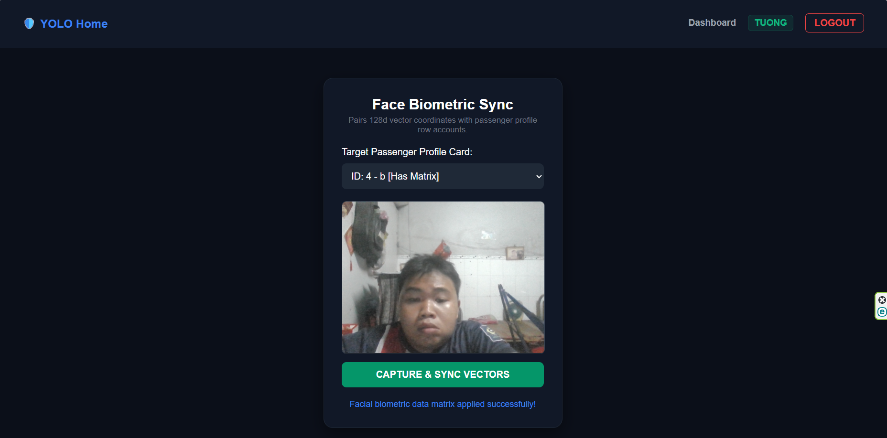


